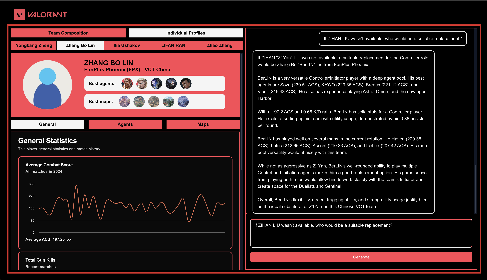

# VCT Esports Manager Notes

  

 #### Try it out [https://vct-esports-manager.mtd-dev.com/](https://vct-esports-manager.mtd-dev.com/)
 (Please try the newest version of our app on the website. There are new features implemented for finalist round. The video on Youtube might not be updated yet since it's spring in Australia, pollen makes my throat swells :(. Below are the [screenshot](#screenshots) as well )
 ## How it works & Architecture
  - AWS Bedrock agent handles the question answer part. The agent has the knowledge base and action groups (including **algorithms** to select team composition) to work with (see below). It's initial instruction is also really clear and provide a lot of information about Valorant.
  - Claude 3 Sonnet is used as the foundation model.
  - We heavily modified the Orchestration setting. An example is provided in the template, guidelines are modified.
  - Next.js application invoke the BedrockAgentRuntime to get the response, using Javascript SDK.
  - The Agent response includes players' IDs, so that we can display the portfolios at the front-end. The portfolios' data (summarized) is stored on the server.
  - The chart data is process from summarized data in run-time with javascript. This helps reduce storage but increase loading time.
  - The video only demonstrates the older version of the chatbot. Please go to our website to use the newest version. Please test the app for result.

  

 ## Features
  - Chatbot interface: You can ask the chatbot various question, including generic questions about Valorant, creating a team, asking about a specific player, or generate a strategy.
  - Player profiles & Team comp suggestion: After our bot created a team for you, the dashboard will show the player profiles and **suggested agents** on all 7 maps currently in rotation. You can generate the strategy for each map (on both offense and defense side).

 ## Human reasoning behind Team composition creation

  
In Valorant, there are 4 main type of agents: **Initiator**, **Controller**, **Sentinel**, and **Duelist**. Additionally, when it comes to specific roles in-game, there are entry fragger, playmaker, support, sniper, lurker, anchor, rotator; and there might be more. 
To generalize, our team found out that a **good Valorant team composition** usually has **all 4 agent types and a Flex IGL with broad knowledge**. 
We rank players based on their **Average Combat Score(ACS)**. However, statistics only partially reflect players' potential, as there are other measurements that can't be seen through statistics: Adaptiveness to new team, communication skill, aim, general game knowledge, pro play strategy knowledge.
No statistics are fully correct, and no strategy dominates over others. We purposely crafted our agent as a **Commentator** rather than a ~~**Statistics ranking bot**~~. The team composition is randomly chosen from **the top 4 team combinations**.

 ## Agent reasoning for specific questions
  ### 1) Build a Valorant team. (Stage 1/Main prompts)
The agent will first analyze the prompt to find out league and region requirements for 5 positions. The action "getGuideline" is used to get the instruction on how to create a team. The action "getPotentialProfiles" is used to get a 5 players that satisfy all condition of a good team(see above). The algorithm add some randomness for variation in team creation. Among the positions, the agent makes sure there is an In-game Leader.
  ### 2) Justify why a player is suitable for a position / Justify a player's performance. (Stage 2 prompt)
The agent will analyze which player the user is talking about. It then use "getPlayersDetailProfile" action to find the specific player detail information. The answer is tailored based on that information.
  ### 3) Which maps would the proposed team composition excels in? (Stage 2 prompt)
The agent will use the "getBestMap" action. The algorithm looks at every players' game records and see which map is played the most. That would be the best map to play in. Then it looks at players' statistics and agents to justify.
  ### 4) Which player would take a leadership (IGL) role in this team? Why? (Stage 2 prompt)
When creating the team, the response has already covered who is best suited for In-game Leader role. If the agent receives this question, it will elaborate the position and the player's stats.

  ### 5) How effective is this player in initiating fights and securing entry kills? (Stage 2 prompt)
Again, the recent performances are looked at. There are some "definitions" on what metrics to look at to assess the role. These are in the guidelines the agent can get.
    

 ## Data notes
 ### Valorant Tournaments Regions & Tiers
 #### 1. VCT International
  - These are tier 1 Valorant Tournaments. Tournaments are hosted directly by Riot Games. There are 4 main regions:
    + Pacific
    + CN
    + Americas
    + EMEA
  - Teams in these regions may compete in some international events.

 #### 2. VCT Challengers
  - These are tier 2 Valorant Tournaments. At the end of the day, there are 4 Ascension Tournaments associated with 4 main tier 1 regions. These tournaments are held to promote 4 tier 2 teams to tier 1. Each regions has many different VCT Challengers tournaments. The structure for these small tournaments evolved in the last few years. Some of these small tournaments don't have data recorded. In general, these are the **RECORDED** region hierachy for the AI deduction.
    + Pacific: SEA (include VN, TH, PH, SG and MY, HK and TW, ID), SA(South Asia), JP, KR
    + CN: **(No recorded tournaments)**
    + Americas: BR, LATAM, LAS, LAN, NA
    + EMEA: Italy & Portugal
  

 #### 3. VCT Game Changers
  In general, these are the **RECORDED** region hierachy for the AI deduction.
    + Pacific: SEA , SA(South Asia), JP, KR, EA(East Asia, also includes JP and KR)
    + CN: **(No recorded tournaments)**
    + Americas: BR, LATAM, NA
    + EMEA

 ### Player stats
  - Only information in **2024** are used. Why? Map rotation (7 maps in professional play) changes often (3 times in 2024 already). Players change team fast. Valorant meta updates constantly. I think older data will reduce the "currently" attribute of the data, since we want to create a Valorant team to play now, not a year ago.
  - There are many aspects to consider when judging a player. Through provided data, these stats are recorded: KDA, ACS, Gun kills, first kill/death rate, average damage per round in regard to these categories: agents, maps, offense/defense, or general.
  - Justification:
    - **Number of game played on specific agent/map** shows a player's mastery on that agent/map. A broad agent/map pool shows that the player understands the game well.
    - **Guns** play an important strategic role in Valorant. Some strategies are:
      - Operator is the one shot sniper and is usually used to lock a site entrance. However, the Operator is the most expensive gun in the game. The stats are important to decide which player should be given the Operator and Sniper role.
      - Shotguns (Judge) are good in maps with corners, and with specific agents like Raze. The stats are important to decide which player can use shotguns, and to create a strategy around that gun.
      - Vandal and Phantom are the 2 strong & expensive ARs in the game with high damage. Players with good stats should use these guns to carry, while others buy utils abilities to support these main carries.
    - **K/D ratio** is a good stat that shows a player's performance. The standard K/D ratio can vary depend on the agent and the strategic role, but in general, a good K/D ratio means a good player.
    - **ACS**(Average Combat Score): This stat has been proved to be one of the good stat to judge the player. More details can be found [here](https://tracker.gg/valorant/articles/what-is-acs-in-valorant-and-how-does-it-work).
    - **Offense and defense stats**: A balance stats between offense and defense means no significant weakness. A good first kill rate on attack means the player is good at entering sites and secure kills. A bad first death rate on defense means the player is bad at defending sites.

    - Data are store in files on **S3**. The agent has an action group that fetch data from S3 and return the information to the agent. Of course the agent has to format input before calling the Lambda function. Information the agent needs to provide include the current Leagues and Regions of players it want to choose to create the team, players' names and ids when it wants more information about the players. Please see the schema of the **Lambda function** [here](data/schema.json). Information includes average **ACS, KDA** on every **agents, maps**. Information about the latest 5 matches is also included.

  
  ### General game information
   - Information about agents and maps are scraped from the web and AI generated.
   - These information includes agents abilities, game roles, maps information.
   - These information are used to create the vector store and knowledge base. When creating teams, the agent will choose a team composition and strategies from its retrieved chunks.

  ### Justification
   - AI is good at reading unstructured data and customize generation, so we only put unstructured data into the knowledge base, so it can create some diversity in answer about Valorant, generic information about team compositions and strategies.
   - Player data is structured. Beside average statistics, time series are the best way to judge a player's performance over time, whether that player is consistent or not. So we plot **time series** into graphs.
  ### Some obstacles
   - Leagues and Regions are rename from abbreviations and "code-like" names to human-readable names.
   - Claude Sonnet 3 likes to return data in XML format :( sometimes. Had to consider that beside JSON.
   - gamePhase=="GAME_ENDED" event is used to get players' KDA, combat score, agents.
   - playerDied and damageEvent events are use to get gun kills and damage.
   - Event with 'snapshot' key is used to get agents, maps.
   - Some team has repeated records (FPX used to play in EMEA, now CN), we only keep the one with latest date.
   - Some players move Leagues/Teams. We only keep the latest Leagues/Teams.
   - I was just using t2.micro for cost reduction but it just lags so I used t3.medium. 
   - The image URLs aren't allowed, so we use a placeholder :)
   - The agents and maps images are taken from Valorant media, I added the tag on Youtube. I edited them to fit into small icons :)

 ## Testing instructions
  - Clone the project
  - To test locally: 
   cd client -> npm install -> create .env.local file to store AWS_ACCESS_KEY_ID and AWS_SECRET_ACCESS_KEY -> npm run dev (or npm run build -> npm start) (Also change the agents ID and alias in [route.ts](client/app/api/invokeAgent/route.ts))
  - Or you can try the deployed version on [https://vct-esports-manager.mtd-dev.com/](https://vct-esports-manager.mtd-dev.com/). This website might be slower / not available sometime due to poor hardware settings (I'm poor :() But it should work most of the time. If you don't receive answer, try again, the server might be disconnected so it couldn't process the prompt.
  - (UPDATED): Throttling issue happens when you generate too often.

 ## Screenshots
 ### Create team & Suggested Agents for every maps & Generate strategy
 
 ### IGL role
 
 ### Player Inclusion Justification
 
 ### Player not available
 
 ### Best map
 
 